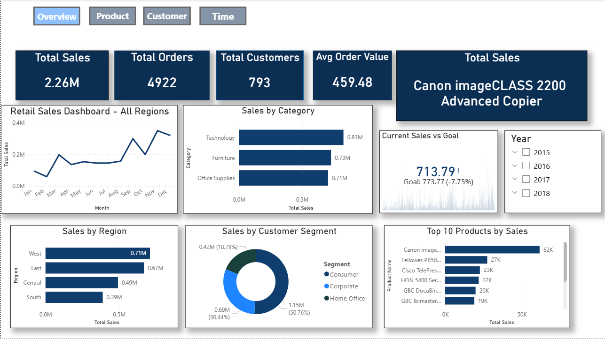
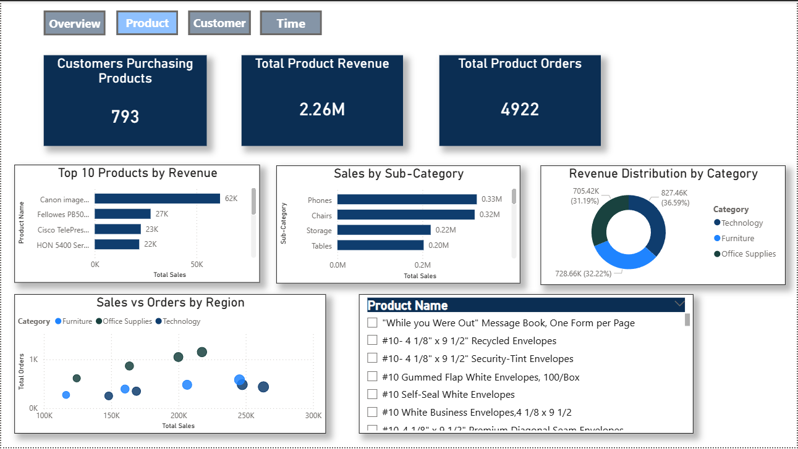
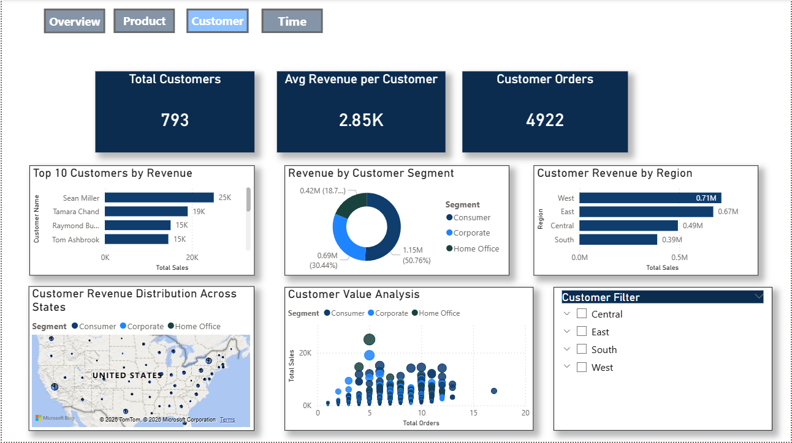
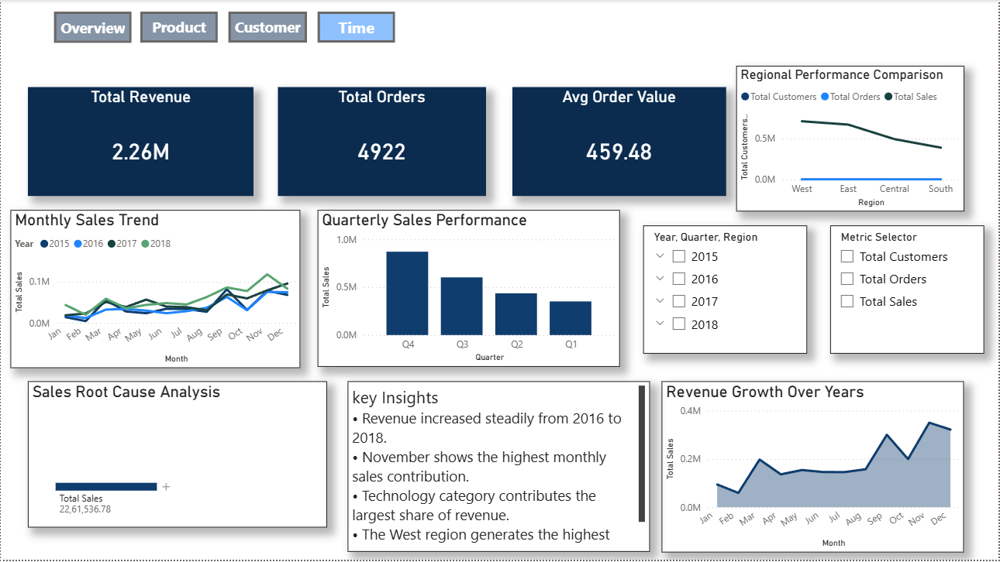
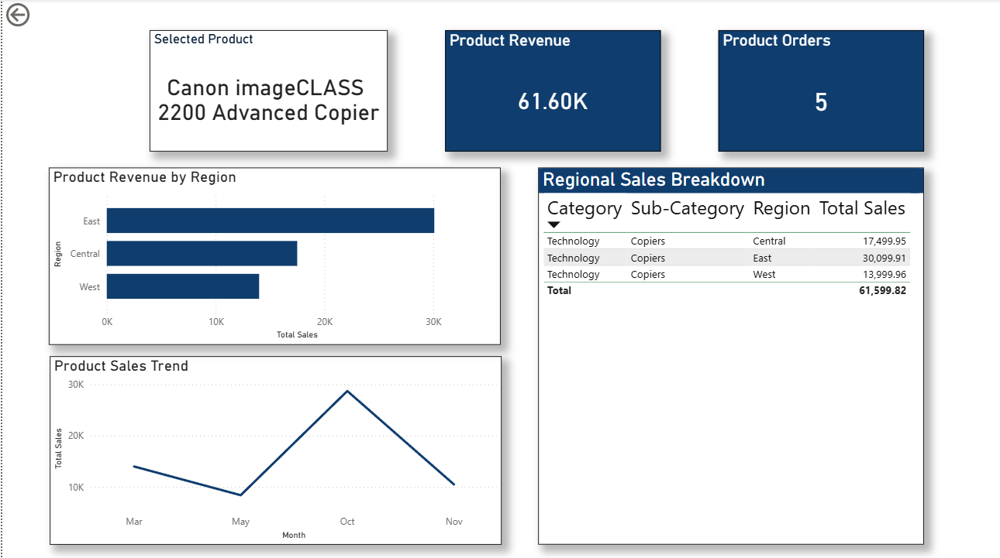
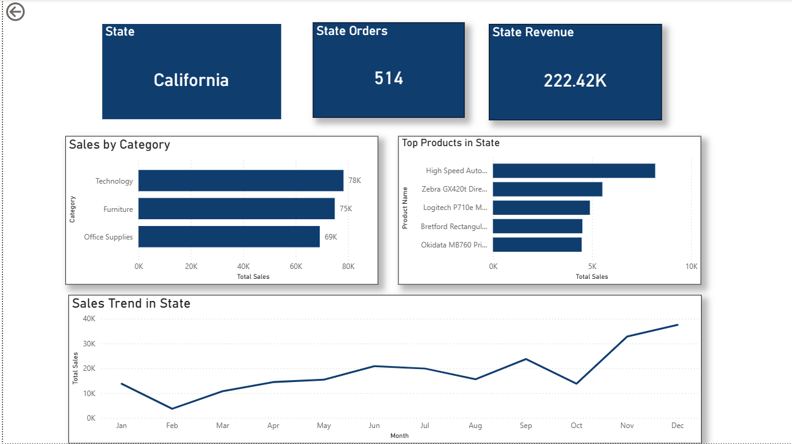

# Retail Sales Analytics Dashboard (Power BI)

## Project Overview

This project presents an **interactive Power BI dashboard** designed to analyze retail sales performance, customer behavior, and product insights.

The dashboard provides a comprehensive view of business performance and enables users to explore data through interactive visualizations and drillthrough analysis.

Key objectives of this dashboard include:

* Monitoring overall sales performance
* Identifying top-performing products
* Understanding customer purchasing behavior
* Analyzing regional sales trends
* Exploring product performance across regions and time

---

# Dashboard Screenshots

## Executive Overview

The overview page provides a high-level summary of key business metrics including total sales, total orders, total customers, and average order value.

---

## Product Analysis

The product analysis page focuses on product performance and revenue distribution across different categories and sub-categories.

Key insights include:

* Top selling products
* Sales by category and sub-category
* Product revenue contribution

---

## Customer Analysis

This page explores customer behavior and segmentation.

It highlights:

* Top customers by revenue
* Revenue distribution by customer segment
* Geographic sales distribution

---

## Time Analysis

This page analyzes sales trends over time to identify seasonal patterns and performance changes.

It includes:

* Monthly sales trends
* Quarterly sales performance
* Revenue growth analysis
* Root cause analysis

---

## Product Deep Dive (Drillthrough Page)

This drillthrough page allows users to analyze detailed information about a selected product.

The analysis includes:

* Product revenue performance
* Product orders
* Regional revenue breakdown
* Monthly product sales trends
* Detailed sales table

---

## Regional Sales Deep Dive

Users can drill through from the map to explore detailed sales performance for specific regions.

This page includes:

* State-level sales analysis
* Category performance by region
* Regional sales trends

---

# Power BI Features Demonstrated

This project demonstrates the use of several advanced Power BI capabilities:

* Data modeling with fact tables
* DAX measures for dynamic calculations
* Drillthrough pages for deeper analysis
* Custom tooltip pages
* KPI indicators
* Field parameters for dynamic metrics
* Smart narrative insights
* Interactive slicers and filters
* Navigation buttons for multi-page dashboards

---

# Tools & Technologies Used

* Power BI
* DAX
* Data Visualization
* Business Intelligence
* GitHub

---

# Business Insights

Key insights from the analysis include:

* Technology category generates the highest revenue.
* West region contributes the largest share of total sales.
* Consumer segment drives the majority of purchases.
* Sales peak during the final quarter of the year.

---

# Author

**Sonia Sakhare**

This project is part of my portfolio demonstrating skills in **data analytics, data visualization, and business intelligence using Power BI**.
